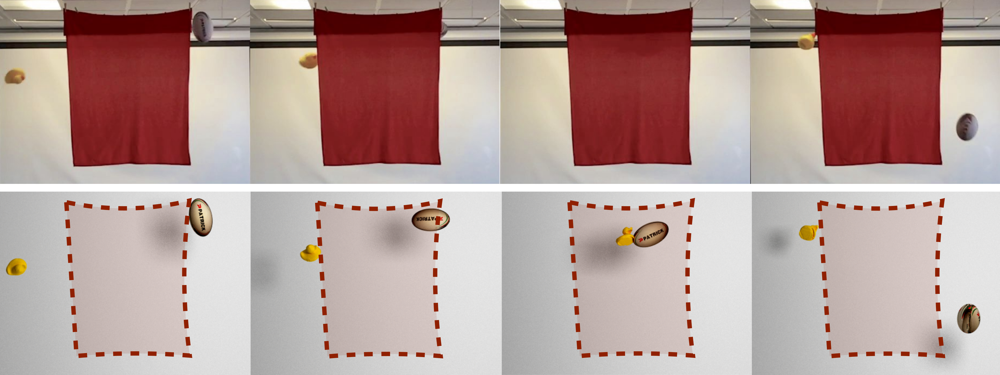

# SMASH
Project page: [SMASH: Physics-guided Reconstruction of Collisions from Videos](http://geometry.cs.ucl.ac.uk/projects/2016/smash/), <br />
Venue: [SIGGRAPH Asia 2016](https://sa2016.siggraph.org) <br />
Authors: [Aron Monszpart](http://geometry.cs.ucl.ac.uk/amonszpart)<sup>1</sup>, [Nils Thuerey](http://ntoken.com)<sup>2</sup>, [Niloy J. Mitra](http://geometry.cs.ucl.ac.uk)<sup>1</sup><br />
<sup>1</sup>University College London <sup>2</sup> Techincal University of Munich


Starting from an input video of a collision sequence behind a curtain (top), SMASH reconstructs an accurate physically valid collision (bottom) using laws of rigid body physics for regularization. Note the reconstructed spin (_i.e._, angular velocity) of the objects.

Videos: [Project](https://www.youtube.com/watch?v=rCZ-1yWJP2Q), [Fast forward](https://youtu.be/927VJX1ilBw) <br />

## Abstract
Collision sequences are commonly used in games and entertainment to add drama and excitement. Authoring even two body collisions in the real world can be difficult, as one has to get timing and the object trajectories to be correctly synchronized. After tedious trial-and-error iterations, when objects can actually be made to collide, then they are difficult to capture in 3D. In contrast, synthetically generating plausible collisions is difficult as it requires adjusting different collision parameters (_e.g._, object mass ratio, coefficient of restitution, _etc._) and appropriate initial parameters. We present SMASH to directly read off appropriate collision parameters directly from raw input video recordings. Technically we enable this by utilizing laws of rigid body collision to regularize the problem of lifting 2D trajectories to a physically valid 3D reconstruction of the collision. The reconstructed sequences can then be modified and combined to easily author novel and plausible collisions. We evaluate our system on a range of synthetic scenes and demonstrate the effectiveness of our method by accurately reconstructing several complex real world collision events.


---

## This repository

### Dependencies
##### Eigen <small>([link](http://eigen.tuxfamily.org/index.php?title=Main_Page))</small>
##### OpenCV <small>([link](http://opencv.org/downloads.html))</small>
| Core modules: | Contrib modules: |
|:-------------:|:----------------:|
| imgproc       | cudabgsegm       |
| highgui       | cudalegacy       |
| core          | [xfeatures2d](https://github.com/opencv/opencv_contrib/tree/master/modules/xfeatures2d) |
Note: see [opencv_contrib/README.md](https://github.com/opencv/opencv_contrib/blob/master/README.md) for installation.

##### [Google] Ceres <small>([link](http://ceres-solver.org))</small>
##### VTK <small>([link](http://vtk.org))</small>
* vtkCommonMath 
* vtkCommonCore 
* vtkRenderingOpenGL 
* vtkRenderingLOD 
* vtkInteractionStyle


### Platform
The code was developed and tested on *Ubuntu 16.04 LTS* with *gcc 6.2*.

---

### Installation
```bash
git clone git@github.com:amonszpart/SMASH.git
cd SMASH
mkdir build && cd build
cmake [-DOpenCV_DIR=<path/to/opencv/share/OpenCV>]..
make -j 8

```

---
### Example
```bash
wget http://geometry.cs.ucl.ac.uk/projects/2016/smash/paper_docs/smash_data.zip
unzip smash_data.zip
cd data/duckElephant
cat run.sh
../../bin/smash --intr intrinsics.txt \
                --frames 0,101,203 \
                --init 2dparabolasInit.json \
                --cub cuboids.json \
                --img-pattern orig240/color_%05d.jpg \
                --fps 240 \
                --show-flags 100000 \
                --weight-velocity 3.16 \
                --weight-conservation-lin 3.16 \
                --weight-observed-q 1. \
                --weight-observed-x 3.16
```

---

### SMASH Blender plugin
* Open the user <b>File</b> -> <b>User Preferences</b>,
* select the <b>Add-ons</b> tab,
* press <b>Install from File</b> and 
* select *smash_blender_plugin/physacqPanel.py*.

If you want it to be enabled on restart, press <b>Save User Settings</b>.

---

### TODO
* Rest of the dataset
* Initialization code